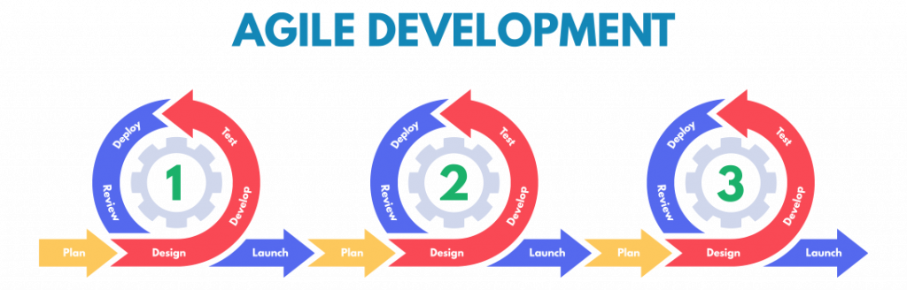
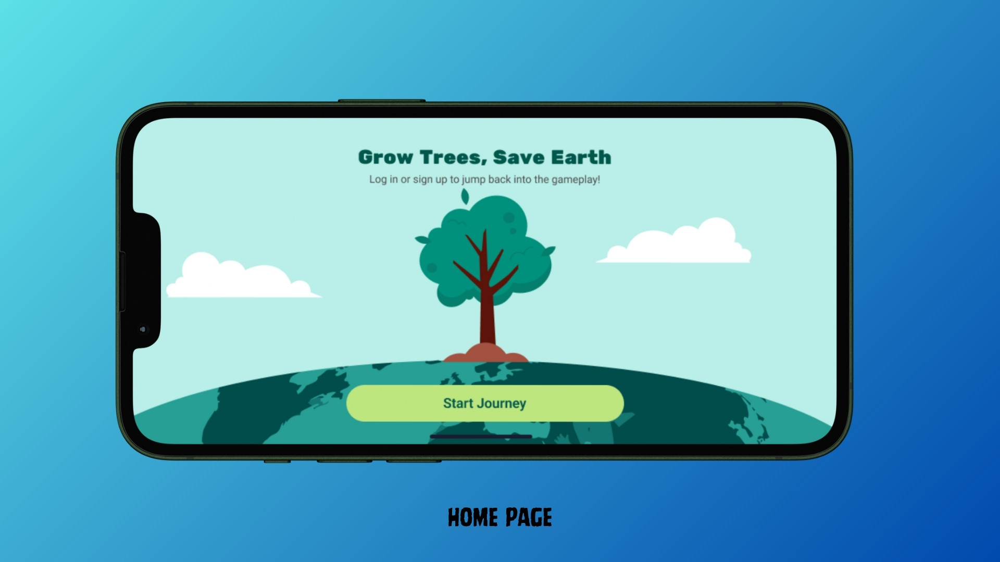
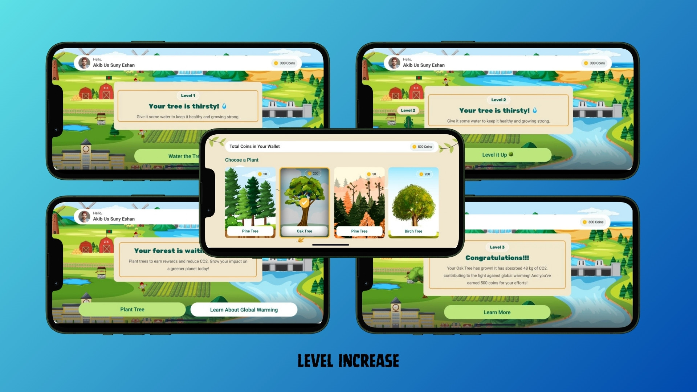
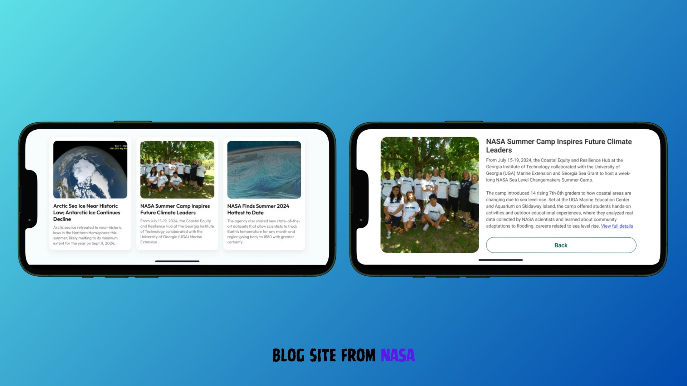
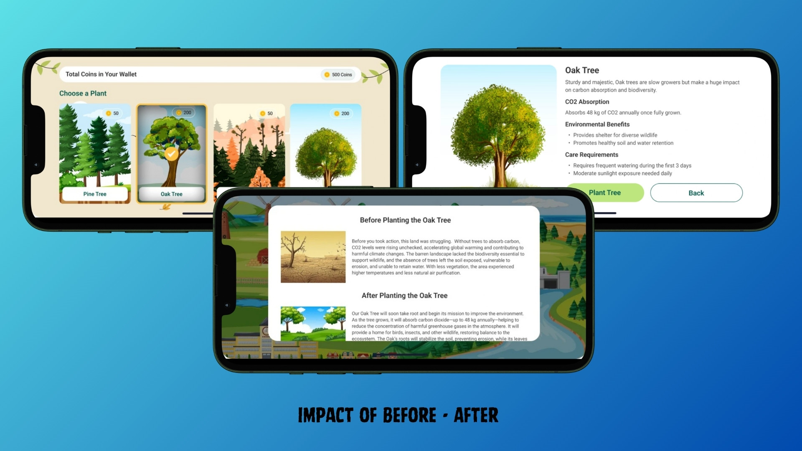
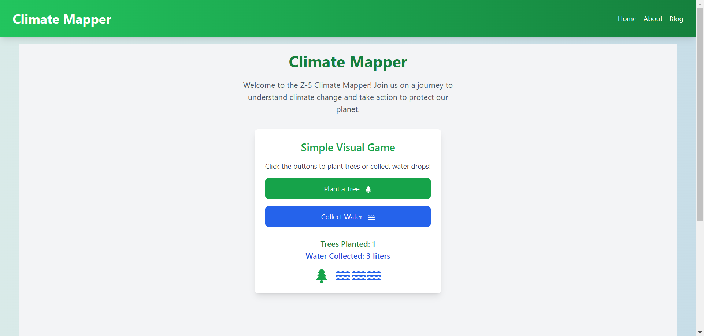
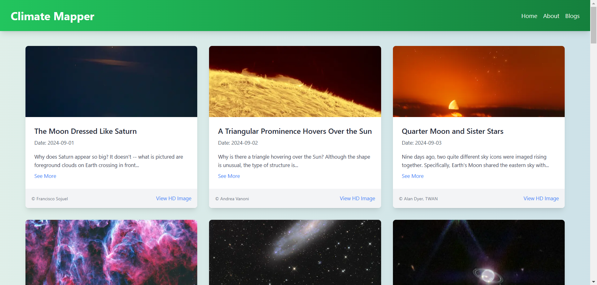

# Climate Mapper

## Overview

The **Climate Mapper** is an innovative 3D climate mapping educational game aimed at helping users, especially students, understand the complexities of global warming and its effects on the environment. By utilizing real NASA climate data, this interactive platform allows users to visualize climate trends, explore environmental changes, and learn about potential solutions to reduce carbon emissions and mitigate global warming.

## Key Features

- **Interactive 3D Climate Simulations**: Users can visualize and interact with real-time climate data in 3D.
- **NASA Climate Data Integration**: Access real satellite data from NASA to enhance climate understanding.
- **Educational Phases**: A two-phase system introduces users to climate change basics before exploring interactive solutions.
- **User-Friendly Interface**: Intuitive navigation designed for both students and educators.
- **Cross-Platform Compatibility**: Accessible on multiple platforms, making it available to a wide range of users.
- **Lesson Plans for Educators**: Comprehensive lesson plans and activities designed to integrate climate education into the classroom.

## Project Goals

The **Climate Mapper** aims to:

- Raise awareness about global warming and climate change.
- Provide a deeper understanding of climate challenges and their global impact.
- Empower users to make informed decisions about sustainability and environmental protection.
- Promote environmental consciousness and inspire climate action.
- Equip educators with effective teaching tools and resources to educate about climate change.

## Agile Development Method

We follow an agile development process to ensure continuous improvements and quick responses to feedback. The iterative process allows for frequent updates and alignment with the project goals, promoting collaboration among the development team.



## How We Addressed the Challenge

The game guides users through two phases in each level:

### 1. Educational Phase:

Introduces critical concepts of climate change through 3D visualizations, covering:

- Causes and contributors to global warming.
- Regional and global impacts of climate change.
- Potential solutions and mitigation strategies.

### 2. Interactive Exploration Phase:

Players explore different regions and ecosystems to understand climate challenges and solutions. They can experiment with actions to visualize their impact on carbon emissions and the environment.

### Additional Resources:

- **3D Climate Maps**: Explore a global climate map with real-time data visualization to understand how various regions are affected.
- **NASA Climate Database**: Access detailed information about climate-related satellite missions and data from NASA.

## Technology Stack

The **Climate Mapper** is built using the following technologies:

- **Next.js**: A React-based framework used for building full-stack web applications. We utilize React Components to build the user interface, and Next.js for server-side rendering and additional optimizations.
- **3D Visualization Framework**: Libraries such as **Three.js** are used to create immersive 3D climate maps and simulations.
- **NASA API**: The NASA API is integrated to fetch real-time satellite data for climate information and trends.

## UI Screenshots

1. **Home Page**:
   

2. **Level Increase Page**:
   

3. **Blog Page**:
   

4. **Impact of Before and After Page**:
   

## Web Implementation UI Screenshots

1. **Home Page**:
   

1. **Blogs Page**:
   

## API Integration

APOD: https://api.nasa.gov/planetary/apod

## Installation and Setup

To set up the project locally, follow these steps:

1. Clone the repository:

   ```bash
   git clone https://github.com/sabbir2809/climate-mapper.git
   ```

2. Navigate to the project directory:

   ```bash
   cd climate-mapper
   ```

3. Install dependencies:

   ```bash
   npm install
   ```

4. Run the development server:

   ```bash
   npm run dev
   ```

5. Open [http://localhost:3000](http://localhost:3000) to view the project in the browser.
